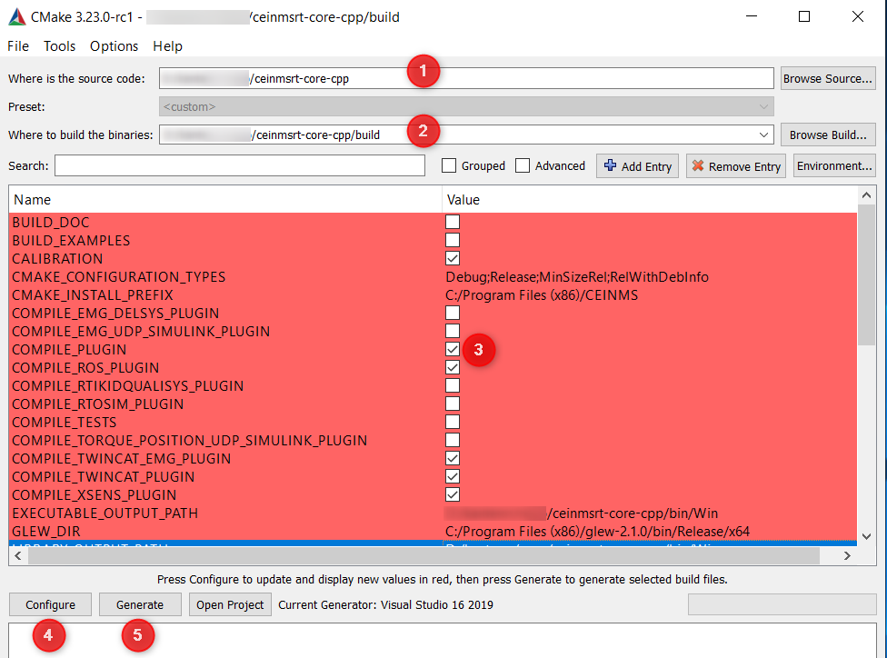

===================
Compilation plugins
===================

.. _Compile ref:

Setup
-----

.. important:: Make sure the newest version of CEINMS-RT is installed on your system before proceeding to this section.
    A guide to installing CEINMS-RT can be found in the :ref:`Installation section <Download ref>`.

.. _CMake ref:

CMake GUI
+++++++++

During the installation process, CMake has been installed on your system. We will now use this software to create
a Visual Studio solution from which we can build the CEINMS-RT plugins. First, search for the cmake-gui app by opening the Windows
search bar. This can be done by pressing the Windows key and typing "cmake". After finding cmake-gui, open it.
You will now be greeted with the GUI of CMake:

* For field ``Where is the source code`` (1) fill in the path of the folder that was created during installation
* For field ``Where to build the binaries`` (2) fill in a subfolder "/build"
* Enable ``COMPILE_PLUGIN`` (3)
* Press ``Configure`` (4)
* Once configuration is complete, select the plugin(s) that you would like to compile
* Press ``Generate`` (5)
* Once generation is complete press ``Open Project`` to open the Visual Studio Project where you can perform the actual compilation

To resolve any compilation errors arise during this build, please refer to the :ref:`Troubleshooting <Trouble ref>` section.