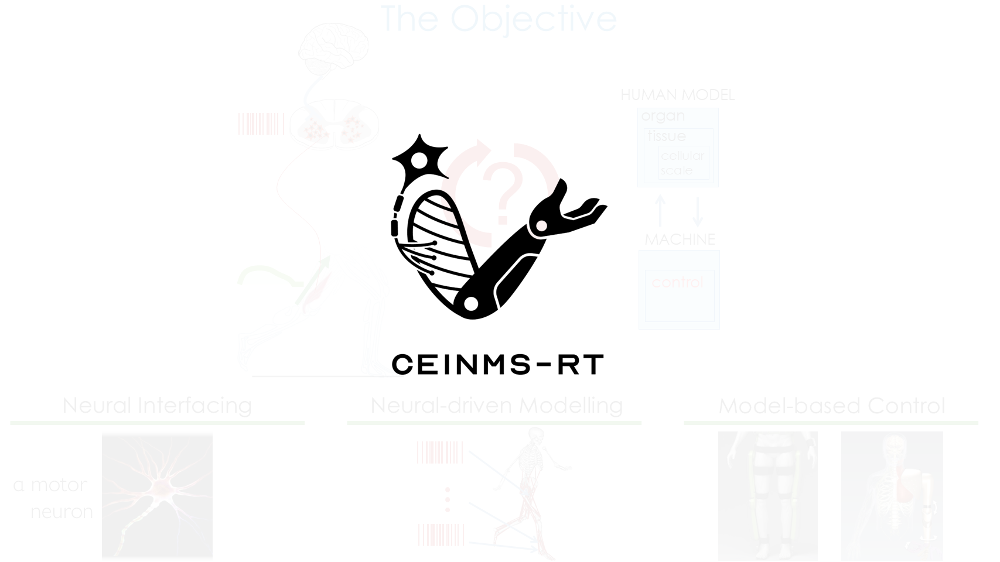

===================
Reference Material
===================

.. _Reference ref:

Webinars
--------

.. _Webinar ref:

CEINMS-RT Kickoff Webinar
+++++++++++++++++++++++++
In this workshop co-organized by the EU `SWAG <https://swag-project.eu/>`_ project, we provide an overview of CEINMS-RT and its environment, 
review the opensource code repository and documentation, and show a live demo using Delsys EMG sensors and Xsens IMUs, 
and take questions from the audience.

Webinar Summary
^^^^^^^^^^^^^^^
The CEINMS Realtime was developed in collaboration with University of Twente, McGill University, and Griffith University. 

CEINMS real-time framework translates EMG signals into biomechanical forces for applications in prosthetics and exoskeletons. 
Massimo Sartori discussed the framework's validation through various studies, confirming its accuracy in estimating joint moments 
and internal forces. The framework is available on GitHub, complete with documentation 
and tutorials. Additionally, he explained the role of plug-ins in integrating data from EMG amplifiers and motion capture systems, which are 
crucial for real-time processing and control applications.

The workshop also covered a sophisticated control framework for ankle exoskeletons, which utilizes real-time estimations of biological joint 
moments. Massimo described how the system's high-level controller interprets EMG signals and joint angles, while a low-level controller manages 
the necessary torque for effective assistance. This collaborative approach allows the exoskeleton to adjust support based on user needs, 
demonstrating versatility across different speeds and terrains. Future releases of CEINMS were discussed, including version 1.2.1 for 
bug fixes and version 1.3, which will introduce Linux compatibility and a more streamlined installation process.

A brief overview of the github repositories, documentation, and a live installation of CEINMS-RT is shown. 

Salvatore Li Gioi conducted a live demonstration showcasing the use of CEINMS-RT with external devices such as Delsys EMG sensors and 
Xsens IMUs. The plugin to read from Delsys EMG is already public. Salvatore used the existing :ref:`plugin templates <repositories ref>` to 
develop his own plugin for Xsens IMUs, which will be made public shortly. The session concluded with a focus on community involvement in 
enhancing the CEINMS platform, encouraging users to report issues and contribute ideas for future developments.