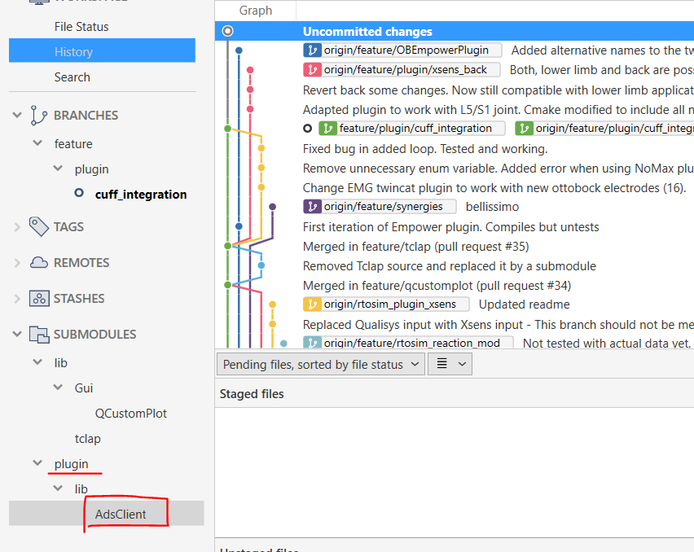
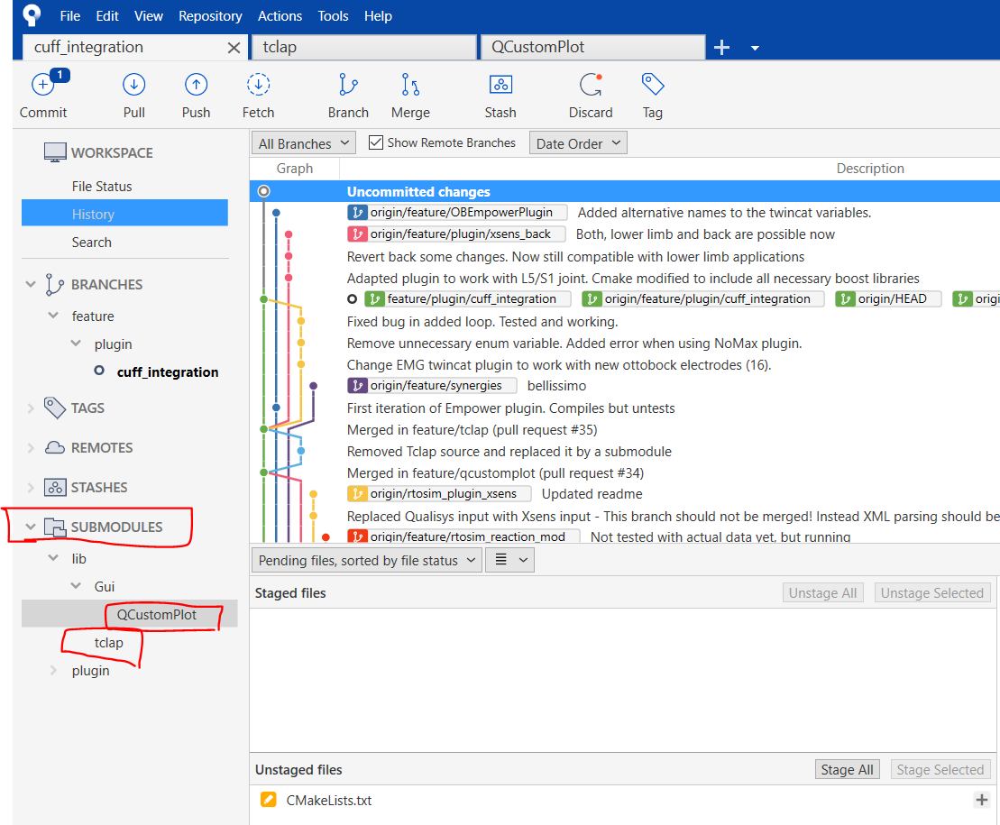
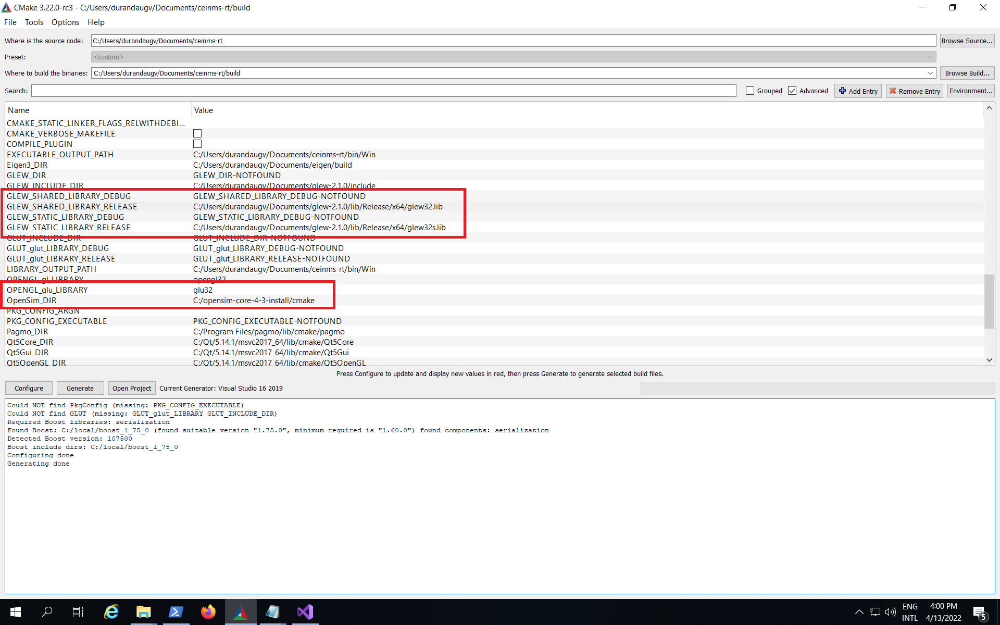
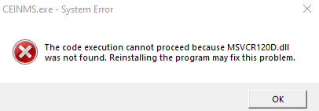

=========================
Troubleshooting [Windows]
=========================

.. _Trouble ref:

Contents
--------

When encountering issues with CEINMS, the following solutions might be adequate:

.. _TS repo access:

no access to the repository
+++++++++++++++++++++++++++

Make sure you have proper clearance to access the repository. If you don't have the necessary permissions,
you won't be able to download files. Check with the repository administrators or owners to ensure that you have the required access rights.

If further clearance is needed, you should contact the members of the repository and clarify your intentions for accessing the files. 
Politely request additional clearance if required, explaining the purpose and reasons behind your request.

Repositories often have specific access control mechanisms in place to protect sensitive or proprietary information. 
Unauthorized access attempts may be flagged and could lead to account suspension or other penalties.

.. _TS ssh pass:

enter ssh passphrase
++++++++++++++++++++

If a password for the rsa ssh-key is already in place, try filling in the password. If the password does not get you through, you can change
the password

open a command terminal and navigating to ``C:/Users/<UserName>/.ssh`` with the ``cd`` command. After this, we change the password using the command:

.. code-block:: console

    ssh-keygen -p -f id_rsa

You will be prompted to enter the old passphrase, after the old passphrase, you will be prompted to enter a new passphrase.
Repeat this new passphrase once more if you require to do so. Now, the passphrase has been updated.

If the old password is unknown, there is no way to change or retieve this password. A new key must be requested or made.

.. _TS tdd12:

Cannot find the library in 'tdd12_debug.all'
++++++++++++++++++++++++++++++++++++++++++++

Add the path of the 'tdd12_debug.dll' into the environmental variable path.

For exmaple:  C:\\Users\\WangH\\Documents\\CEINMS_dependency\\oneTBB\\build\\msvc_19.16_cxx_64_md_debug

.. _TS cmake AdsClient:

Cannot find the cmake files in 'AdsClient'
++++++++++++++++++++++++++++++++++++++++++

Similar to the issue below, this plugin needs to be manually added:

.. _TS cmake tclap:

Cannot find the cmake files in 'tclap' and 'QCustomPlot'
++++++++++++++++++++++++++++++++++++++++++++++++++++++++

For example:

**CMake Error at lib/Gui/CMakeLists.txt:3 (add_subdirectory):
The source directory**

**C:/Users/WangH/Documents/cuff_integration/lib/Gui/QCustomPlot**

**does not contain a CMakeLists.txt file.**

Solution: manually download these two dependencies from bitbucket.

In source_tree, there is an option called 'SUBMODULES', you need to double click these two modules to download their source code:

.. _TS glew obj:

Cannot open file 'glew-2.1.0/lib/Release/x64.obj'
+++++++++++++++++++++++++++++++++++++++++++++++++

The 'glew32.lib' and 'glew32s.lib' need to be set in the CMake path, as shown below:

.. _TS glew lib:

Cannot find the 'glew32.lib' or .dll
++++++++++++++++++++++++++++++++++++

Add variables CMAKE_PREFIX_PATH in the CMAKE gui specifying the path to the glew folder. 

If you still have problems add also the variable GLEW_HOME_DLL and fill it with the path to the .dll file. 

.. _TS find Opensim:

Cannot find OpenSim
+++++++++++++++++++

If using the command line:

-CMAKE_PREFIX_PATH="C:\\pathto\\opensim\\cmake"

in the GUI see the picture:

.. _TS Opensim:

Opensim 4.3
+++++++++++

Add:
 **include_directories(${OPENSIM_ROOT_DIR}/sdk/spdlog/include)**

After:
 **find_package(OpenSim REQUIRED)**

XSD
+++

**Compilation**

error C2872: 'DOMDocument' : ambiguous symbol : in the file:

C:\\Program Files (x86)\\CodeSynthesis XSD 4.0\\include\\xsd\\cxx\\tree\\serialization.txx

In line 104, change:
 DOMDocument& doc (*e.getOwnerDocument ());

by:
 xercesc_3_1::DOMDocument& doc (*e.getOwnerDocument ());

MSVCR120D
+++++++++

Follow the instructions here: `CEINMS-70 <https://be.et.utwente.nl/jira/browse/CEINMS-70?src=confmacro>`_ - `Authenticate <https://be.et.utwente.nl/confluence/plugins/servlet/applinks/oauth/login-dance/authorize?applicationLinkID=92039d18-b30d-3b97-be17-a4cb2021224a>`_ to see issue details
So just download the zip file and copy msvcr120d.dll into ``C:\Windows\System32``. Then, run the command line: 

.. code-block:: console

   C:\Windows\System32> certutil -hashfile .\msvcr120d.dll

CMake Error at plugin/CMakeLists.txt
++++++++++++++++++++++++++++++++++++

The source directory
C:/............./plugin/lib/AdsClient
does not contain a CMakeLists.txt file

Type in the terminal: git submodule update --init